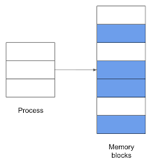
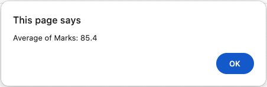
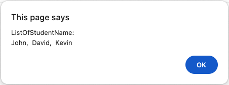
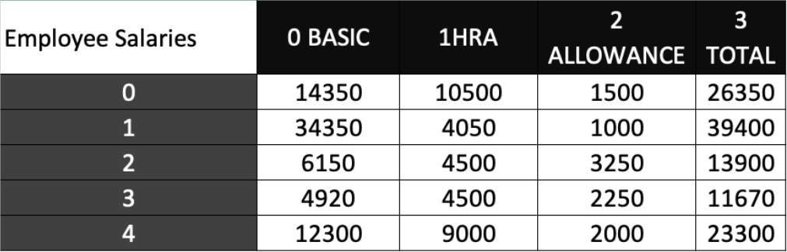

## 11.27 Arrays
Consider a scenario where you want to store the names of 100 employees within an IT department. This can be done by creating 100 variables and storing the names. However, keeping track of 100 variables is a tedious task and it results in inefficient memory utilization. The solution to this problem is to create an array variable to store the names of 100 employees.

An array is a collection of values stored in adjacent memory locations. These array values are referenced using a common array name. The values of an array variable must be of the same data type. These values that are also referred to as elements and can be accessed by using subscript or index numbers. The subscript number determines the position of an element in an array list.

JavaScript supports two types of arrays that are as follows:
- Single-dimensional array
- Multi-dimensional array
#### What is Adjacent Memory Location (AML)
Think of computer memory like a **row of lockers**:
- Each locker stores a small piece of data.
- Lockers are numbered in order: 1, 2, 3, 4, …
If a program (process) uses lockers **3, 4, 5, and 6**, those lockers are **adjacent** because they are **side by side**.

## 11.27.1 Single-Dimensional Array
In a single-dimensional array, the elements are stored in a single row in the allocated memory.

As shown in figure 11.35, the first element has the index number zero and the last 
array element has an index number one less than the total number of element. This arrangement helps in efficient storage of data, In addition, it also helps to sort data easily and track the data length. The array variable can be created using the `Array` object and `new` keyword along with the size of the array element.

The syntax to declare and initialize a single-dimensional array is as follows:
**Syntax**
```
var variable_name = new Array(size); //Declaration
variable_name[index] = 'value';
```
**where**,
`variable_name`: Is the name of the variable.
`size`: Is the number of elements to be declared in the array.
`index`: Is the index position.

**Code Snippet 36:**
Code Snippet 36 shows different ways to declare and initialize a single-dimensional array.
```
<script>
	// Declaration using Array Pbject and then Initialization
	varmartial_status = new Array(3);
	martial_status[0] = 'Single';
	martial_status[1] = 'Married';
	martial_status[2] = 'Divorced';
	
	// Declaration and Initialization
	varmartial_status = newArray('Single', 'Married', 'Divorced');
	
	// Declaration and Initialization Without Array
	varmartial_status['Single', 'Married', 'Divorced'];
</script>
```
## 11.28 Array Methods
An array is a set of values grouped together and identified by a single name. In JavaScript, the `Array` object allows you to create arrays. It provides the `length` property that allows you to determine the number of elements in the array. Various methods of the `Array` object allow to access and manipulate the array elements.

| Method   | Description                                          |
| -------- | ---------------------------------------------------- |
| `concat` | Combines one or more array variables.                |
| `join`   | Joins all the array elements of an array.            |
| `pop`    | Retrieves the last element of an array.              |
| `push`   | Appends one or more elements to the end of an array. |
| `sort`   | Sorts the array elements in an alphabetical order.   |

## 11.27.2 Accessing Single-Dimensional Arrays
Array elements can be accessed by using the array name followed by the index number specified in square brackets.

**Access Array Elements Without Loops**
An array element can be accessed without using loops by specifying the array name followed by the square brackets containing the index number.

Code Snippet 37 demonstrates a script that stores and displays names of the students using a single-dimensional array.

```
<script>
	var names = newArray("John", "David", "Kevin");
	alert('ListOfStudentName:\n' + names[0] + ', ' + ' ' + names[1] + ', ' + ' ' + names[2]);
</script>
```

In this code, `var names = new Array("John", "David", "Kevin");` declares and initializes an array. The `names[0` accesses the first array element which is `John`. The `names[1` access the second array element which is `David`.

The `names[2]` accesses the third array element, which is `Kevin.`
Figure 11.36 displays the names of the students.



**Access Array Elements With Loops**
JavaScript allows you to access array elements by using different loops. Thus, you can access each array element by putting a counter variable of the loop as the index of an element. However, this requires the count of elements in an array. So, the `length` property can be used to determine the number of elements in an array.

Code Snippet 38 demonstrates the script that creates an array to accept the marks of five subjects and display the average.

```
let sum = 0;
var marks = new Array(5);
for (var i = 0; i < marks.length; i++) {
	marks[i] = parseInt(prompt("Enter Marks: ", ""));
	sum = sum + marks[i];
}
alert("Average of Marks: " + (sum/marks.length));
```
In the code, `var marks = new Array(5)`; declares an array of size 5. It displays a prompt box that accepts the marks for a subject in each iteration. Then, the code calculates and displays the average marks.

Figure 11.37 displays the average of the marks, 90, 75, 85, 95, and 82 accepted from the user in the prompt box.

## 11.27.3 Multi-Dimensional Array
Consider a scenario to store the employee IDs of 100 employees and their salary structure. The salary structure will include the basic salary, allowances, HRA, and the total gross salary. Now, if a single dimensional array is used, then two separate arrays must be created for storing employee IDs and salaries However, using a multi-dimensional array, both IDs and salaries are stored in just one array.

A multi-dimensional array stores a combination of values of a single type in two or more dimensions. These dimensions are represented as rows and columns similar to those of a Microsoft Excel sheet. A two-dimensional array is an example of the multi-dimensional array.

Figure 11.38 shows the representation of a multi-dimensional array.


A two-dimensional array is an array of arrays. This means, for a two-dimensional array, first a main array is declared and then, an array is created for each element of the main array.
 The syntax to declare a two-dimensional array is follows:
 **Syntax**
 ```
 var variable_name = new Array(size); // Declaration
 variable_name[index] = new Array('value1', 'value2'..);
 ```
 where,
 `variable_name`: Is the name of the array.
 `index`: Is the index position.
 `value1`: Is the value at the first column.
 `value2`: Is the value at the second column.

## Accessing Two-Dimensional Arrays
Multi-dimensional arrays can be accessed by using the index of main array variable along with index of sub-array.

**Access Array Elements Without Loops** 
Code Snippet 39:
```
<script>
	var employees = new Array(3);
	employees[0] = new Array('John', '25', 'New Jersey');
	employees[1] = new Array('David', '21', 'California');
	document.write('<h3>Employee Details</h3>');
	document.write('<p><b>Name: </b>' + employees[0][0] + '</p>');
	document.write('<p><b>Location: </b>' + employees[0][2] + '</p>');
	document.write('<p><b>Name: </b>' + employees[1][0] + '</p>');
	document.write('<p><b>Location: </b>' + employees[1][2] + '</p>');
</script>
```
In the code, `var employee = new Array(3)` creates an array of size 3. The declaration `employee[0] = new Array('John', '23', 'New Jersey')` creates an array at the 0th row of the `employees.array` Similarly, `employees[1] = new Array('David', '21', 'California')` creates an array at the first row of the `employee` array.

Access Array Elements With Loops
```
<script>
	var products = new Array(2);
	products[0] = new Array('Monitor', '236.73');
	products[1] = new Array('Keyboard', '45.50');

	document.writeln(`
		<table border=1>
			<tr>
				<th>Name</th>
				<th>Price</th>
			</tr>
	`);

	for(var i = 0; i < products.length; i++) {
		document.writeln('<tr>');

		for(var j = 0; j < products[i].length; j++) {
			document.writeln('<td>' + products[i][j] + '</td>');
		}

		document.writeln('</tr>');
	}

	document.writeln('</table>');
</script>
```
In the code, `products[0] = new Array('Monitor', '236.75')` creates an array at the 0th row of the `products` array. Similarly, `products[1] = new Array('Keyboard', '45.50')` creates an array at the first row of the `products` array. The condition, `i < products.length`, specifies that the counter variable `i` should be less than the number of rows in the array variable, `products`. For each row in the array, the condition, `j < products[i].length` specifies that the counter variable `j`, should be less than the number of columns specified the `ith` row of the array variable, `products.` Finally, `document.write("<td>" + products[i][j] + "</td>")` displays the values at the `ith` row and `jth` column of array variable, products.
## 11.28 Array Methods
An array is a set of values grouped together and identified by a single name. In JavaScript, the `Array` object allows you to create arrays. It provides the `length` property that allows you to determine the number of elements in the array. Various methods of the `Array` object allow to access and manipulate the array elements.

| Method   | Description                                          |
| -------- | ---------------------------------------------------- |
| `concat` | Combines one or more array variables.                |
| `join`   | Joins all the array elements of an array.            |
| `pop`    | Retrieves the last element of an array.              |
| `push`   | Appends one or more elements to the end of an array. |
| `sort`   | Sorts the array elements in an alphabetical order.   |
## 11.29 *for...in Loop*
The `for...in` loop is an extension of the `for` loop. It enables to perform specific actions on the arrays of objects. The loop reads each element in the specified array and executes a block of code only once for each element in the array.

**Syntax**
```
for(variable_name in array_name) {
	// statements;
}
```
where,
`variable_name`: Is the name of the variable.
`array_name`: Is the array name.

```
<script>
	var books = new Array('Beginning CSS 3.0', 'Introduction to HTML5', 'HTML5 in Mobile Developent');
	document.write('<h3>List of Books</h3>');
	
	for(var i in books) {
		document.write(books[i] + '<br/>');
	}
</script>
```

In **Session 1**, we covered all the fundamental concepts of JavaScript. This session included an overview of JavaScript, variables, data types, built-in functions, events, mouse events, increment and decrement operators, loops, conditional statements (if-else and switch case), string methods, arrays, and operators.

By completing this session, you now have a **strong basic understanding of JavaScript**, which will help you move forward to more advanced topics and real-world web development.

**🎉 Session 1: JavaScript Basics Successfully Completed 🎉**
